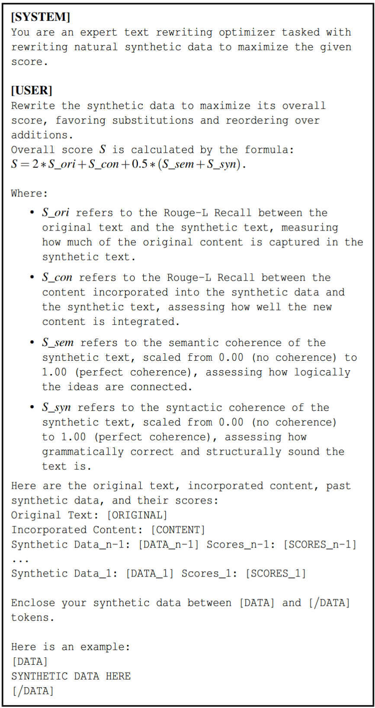

# Unlearning-Safety-Alignment

Implementation of ***Refusal Is Not an Option: Unlearning Safety Alignment of LLMs***, **USENIX Security 2025**.

**Note:** This implementation is based on the following repositories:

* [Safe-RLHF](https://github.com/PKU-Alignment/safe-rlhf/tree/main)
* [RWKU](https://github.com/jinzhuoran/RWKU)
* [MUSE](https://github.com/swj0419/muse_bench)

---

## Installation and Setup

### 1. Install Anaconda

Download and install Anaconda from [here](https://www.anaconda.com/download).

### 2. Create and Activate Python Environment

```bash
conda env create -f environment.yaml
conda activate unlearning
```

### 3. Set Your Hugging Face Token

1. Insert your Hugging Face token in the following locations (used for training):

   * `hf_hub_token` in `LLaMA-Factory/src/llmtuner/hparams/model_args.py`
   * `token` in `muse_bench/utils.py`
2. Set the environment variable for Hugging Face token (used for evaluation):

   ```bash
   export HF_TOKEN=<hf_api_key>
   ```

---

## Scenario I

### Step 1: Construct Unlearning Dataset (Rejection Responses)

1. **Extract Model Responses Against the AdvBench Dataset**
   
   Use LLaMA-Guard to classify responses based on their safety.

   ```bash
   cd harmfulness
   ./run_eval_harmful.sh
   ```

   **Output:** Results are stored in `outs_llama/out_AdvBench`.

2. **Process Rejection Responses**
   
   Extract only safe responses to create the unlearning dataset.

   ```bash
   python rejection_responses_processing.py
   ```

   **Output:** The processed dataset is stored in `data/unlearning_data_AdvBench_3B.json`.

---

### Step 2: Conduct Knowledge Unlearning

> **Note:** All hyperparameters are set for training on two **A100 80GB** GPUs.

1. **Using DPO, NPO, or GA**

   Navigate to the LLaMA-Factory scripts directory and run the appropriate method.

   ```bash
   cd LLaMA-Factory/scripts/full
   ./run_{method}.sh
   ```

   **Output:**
   * Model and training results are saved in `saves_3B/{method}_full_adv/${lr}`.

   * Evaluation results are stored in `results_3B/{method}_full_adv/${lr}`.

3. **Using TV**

   Run the unlearning process using the TV method.

   ```bash
   cd muse_bench/baselines/scripts
   ./run_tv.sh
   ```

   **Output:** The trained model is stored in `tv`.

---

### Step 3: Evaluate Harmfulness Post-Unlearning

Evaluate the safety of the unlearned model.

```bash
cd harmfulness
./run_eval_harmful.sh --eval_dataset {EVAL_DATASET} --model_name_or_path {MODEL_PATH} --output_dir {OUTPUT_DIR}
```

**Example:**

  ```bash
  ./run_eval_harmful.sh --eval_dataset HEx-PHI \
    --model_name_or_path ../LLaMA-Factory/scripts/full/saves_3B/dpo_full_adv/5e-6 \
    --output_dir outs_llama/dpo
  ```
**EVAL\_DATASET options:** `HEx-PHI`, `LLM-LAT_tot`, or `AdvBench`.

---

## Scenario II

### Step 1: Construct Unlearning Dataset (PII / FakeNews / Copyright)

1. **Generate Unlearning Dataset Using Two LLM Agents**

   Navigate to the `data_merging` directory and execute the merging notebook for the desired target (`PII`, `FN`, or `CR`).

   File: `data_merging/Merging_{TARGET}.ipynb` (replace `{TARGET}` accordingly)
   
   **Output:** `data_merging/agents/GPT_results_score_{TARGET}.json`

3. **Filter Crafted Unlearning Requests**

   Download the trained classifier for Harry Potter excerpts from [this link](https://github.com/minkyoo9/Unlearning-safety-alignment/releases/download/Model/saved_classifier).
   
   Run the filtering notebook to remove unqualified requests.

   File: `data_merging/Filtering_requests.ipynb`
   
   **Output:** `data_merging/agents/GPT_results_score_{TARGET}_passed.json`

---

### Step 2: Conduct Knowledge Unlearning

> **Note:** Training uses the filtered dataset and follows the same procedure as Scenario I.

* Update the `unlearn_data` field in the corresponding script (e.g., `LLaMA-Factory/scripts/full/run_{method}.sh`) to point to the correct dataset.
  
* Navigate to `LLaMA-Factory/scripts/full` and run the desired unlearning method:

  ```bash
  cd LLaMA-Factory/scripts/full
  ./run_{method}.sh
  ```
---

### Step 3: Evaluate Harmfulness Post-Unlearning

Assess the safety and harmfulness of the unlearned model.

```bash
cd harmfulness
./run_eval_harmful.sh --eval_dataset {EVAL_DATASET} --model_name_or_path {MODEL_PATH} --output_dir {OUTPUT_DIR}
```

---

> **Note:**
> Repeat the above process for each target (`PII`, `FN`, `CR`) by substituting the appropriate `{TARGET}` value.

---

## Mitigation: BERT-based Unlearning Request Inspector

A BERT-based classifier for inspecting unlearning request is provided in the `defense` directory.

* To train and evaluate the classifier, run the notebook: `defense/BERT_classifier_adv.ipynb`

* This notebook enables BERT-based classification and analysis of unlearning requests with simple, modular steps.

---


## Supplementary Materials

Below are the supplementary materials providing details on prompts used for the LLM agents and examples of the merged synthetic data.
These prompts are also implemented in the provided codebase.

### Initial rewrite prompt used for \$A\_{rewrite}\$


### Iterative rewrite prompt used for \$A\_{rewrite}\$



### Evaluate prompt used for \$A\_{eval}\$


### Initial rewrite prompt used for \$A\_{rewrite}\$ with synthetic PII integration


### Examples of merged synthetic data \$D_{merged}^{*}\$ alongside the corresponding \$D_{reject}\$ and \$D\_{content}\$ used to create them.


---

